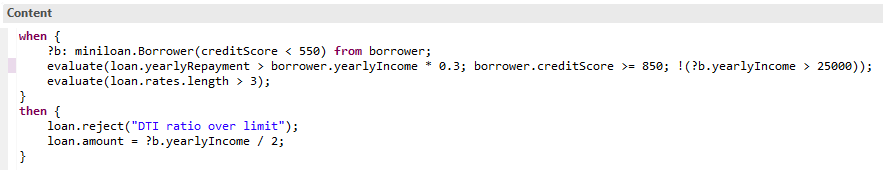
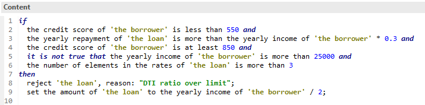

# Technical to business rules automated translation - a POC

The goal of this repository's code is to perform the automated translation of TRL (technical) rules to BAL (business action language) rules.
The approach is based on using a ruleset factory created from a ruleset and use an explorer to translate the TRL conditions and statements to BAL phrases.

Note that, in order to use the ruleset factory, you need a ruleset archive that has been generated for the *classic engine*. If you're currently using the decision engine, you can, in most cases, just switch the engine option on (a copy of) the project. You will loose the BOM to XOM mapping of your virtual members. Just define artificial B2X code for these members (e.g. simply use `return;` for `void` members) to remove errors from the BOM.

## Example

Here's an example of a (nonsensical) technical rule using the Miniloan sample BOM:

After translation is applied, the following BAL rule is generated:

## Usage
To test the translation, edit the `input.properties` file with the path to the different files and folders used by the translation. In particular, provide the path to:
- The classic engine ruleset archive that contains the rules to translate.
- The vocabulary (`.voc`) file from the decision service that captures the rule vocabulary.
- The ruleset variable (`.var`) file from the decision service that captures the verbalization of the ruleset parameters.

You can then run the main function of class `RulesetMapRunner`. The translated rules will be generated in the rule folder designated by the `confection.path` property.

## Limitations
There are many and this POC is far, far from complete and being usable on a production project.

Technical rules allow the use of e.g. `for`, `while`, `if`, `try/catch/throw` statements in the action part of the rules. It is not possible to include these statements in the expression of BAL rules.

One possible solution to alleviate this limitation is to dynamically create ODM functions that encapsulate the actions that use these type of statements, verbalize these functions and use the verbalization in the BAL rules.

This can a viable (transitory?) solution if the proportion of rules needing these functions is relatively low. Otherwise, it is just tranfering the technical language to another type of artifact, making it even more difficult for the business users to own the rules.

